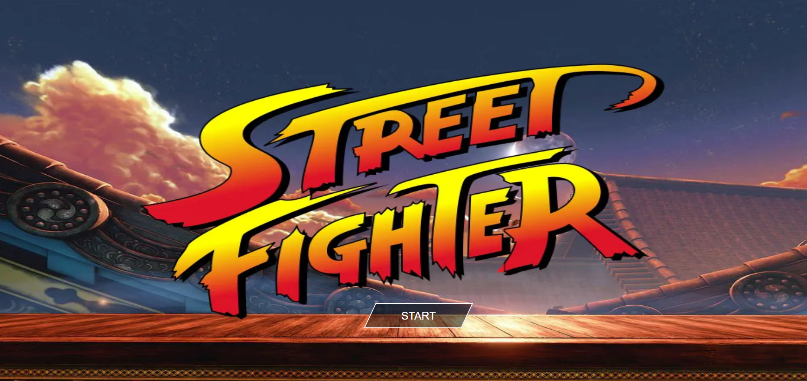
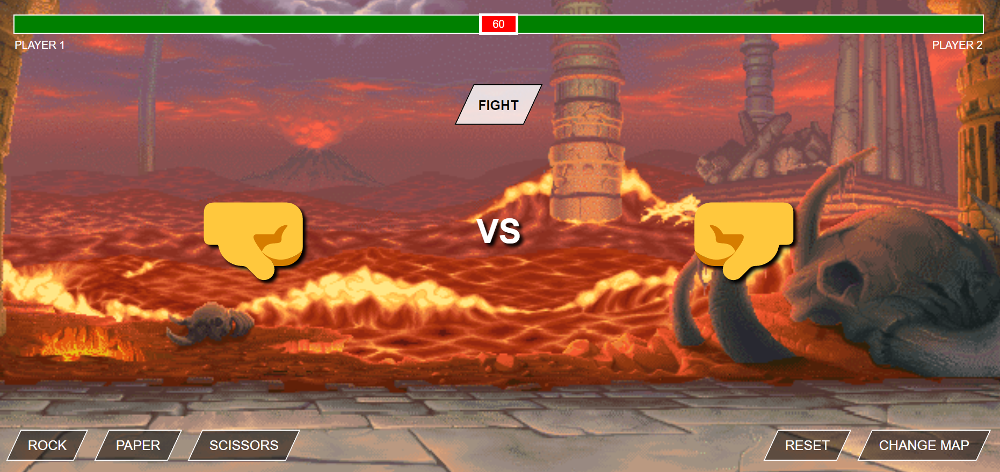
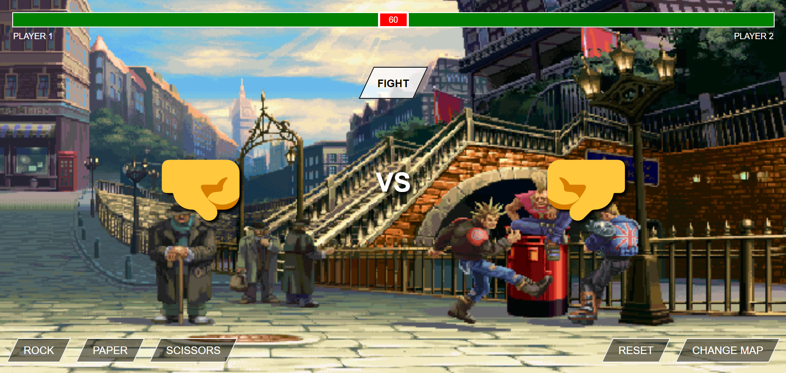

# Street Fighter Rock-Paper-Scissors Game
This is a mini rock-paper-scissors game with a Street Fighter theme. The game has been written using HTML, CSS, and JavaScript. Players can choose their move by clicking on one of three icons representing rock, paper, or scissors, and play against the computer.

## Game Play
Players choose their move by clicking on one of three icons representing rock, paper, or scissors. The computer then randomly selects its move. The game logic then determines the winner based on the traditional rock-paper-scissors rules:

- Rock beats scissors
- Scissors beats paper
- Paper beats rock
The winner is announced, and the score is updated. The game continues until the player chooses to quit or the score limit is reached.

## Street Fighter Theme
The game has a Street Fighter theme, with a background image of the iconic Street Fighter stage, and characters from the series representing the rock, paper, and scissors moves. The icons for the moves have been designed to resemble Street Fighter-style attacks.

## overview :

|  |

|  |

|  |

## Conclusion
This Street Fighter themed rock-paper-scissors game provides an enjoyable and interactive experience for fans of the series. The game has been written using HTML, CSS, and JavaScript, and features a themed interface and game play mechanics. Players can enjoy the classic rock-paper-scissors game with a unique twist, while immersing themselves in the world of Street Fighter.
